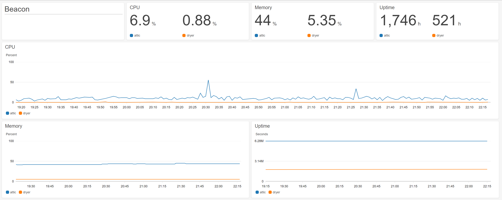

# beacon
 [](https://goreportcard.com/report/github.com/shazbits/beacon) [](https://sonarcloud.io/dashboard?id=shazbits_beacon)

Tiny system beacon reporting CPU, memory, uptime to logs, cloudwatch, http

## Usage

Metrics can be sent to logs (stdout), cloudwatch, or posted as json to an http endpoint.
The output is silent for cloudwatch and http, unless an error occurs.

Here, we send the metrics to both logs, cloudwatch, and http endpoint:

```
# config.yaml
interval: 60s
targets:
  - type: log
  - type: cloudwatch
  - type: url
    arg: http://example.com/heartbeat
```

```
$ beacon
2019/05/30 08:18:05 {Hostname:desktop HostID:83124810-114D-9785-2296-468d43bbbcd5 CPUPercent:8.359375 MemPercent:40 Uptime:6086447}
2019/05/30 08:19:05 {Hostname:desktop HostID:83124810-114D-9785-2296-468d43bbbcd5 CPUPercent:7.682194 MemPercent:40 Uptime:6086507}
...
```

```
$ beacon --help
Usage of /usr/local/bin/beacon:
  -config string
        Path to the configuration file
```

### Cloutwatch example

[](assets/cloudwatch.png)

### Configuration

The default configuration file path is:
* `/etc/beacon/config.yml` on Linux and OSX
* `./` on Windows (the current directory from which beacon.exe is invoked)

Config.yml reference:
* `interval`: the interval in seconds at which metrics are sampled and sent.

* `targets`: one or more targets to send metrics to. Possible `type` values are `log`, `cloudwatch`, `url`.

  * The `arg` of the `cloudwatch` type is the name of the namespace receiving the metrics. By default, the namespace name is set to *beacon*.

  * The `arg` of the `url` type is the destination url, accepting a POST request with json payload.

  * The `arg` of tye `log` type is currently unused.


## Installation

### Binary release

Built binaries are available in [Releases](../../releases), for the following platform/processor types:
* Linux/amd64
* OSX/amd64
* Windows/amd64

You can use the script below to download, install, and configure a version of your choice (edit the first line with your preferences):

```
BEACON_VERSION=v1.1.0 BEACON_OS=linux BEACON_ARCH=amd64 BINARY_DEST=/usr/local/bin CONFIG_DEST=/etc/beacon ; \
  wget https://github.com/shazbits/beacon/releases/download/$BEACON_VERSION/beacon-$BEACON_OS-$BEACON_ARCH-$BEACON_VERSION.tgz \
  && tar xzf beacon-$BEACON_OS-$BEACON_ARCH-$BEACON_VERSION.tgz \
  && chmod +x beacon-$BEACON_OS-$BEACON_ARCH-$BEACON_VERSION/beacon \
  && sudo mkdir -p $CONFIG_DEST \
  && sudo cp -t $BINARY_DEST beacon-$BEACON_OS-$BEACON_ARCH-$BEACON_VERSION/beacon \
  && sudo cp beacon-$BEACON_OS-$BEACON_ARCH-$BEACON_VERSION/config.yml.example $CONFIG_DEST/config.yml \
  && echo Configuration file: $CONFIG_DEST \
  && vi $CONFIG_DEST/config.yml
```

### From source

```
$ git clone https://github.com/shazbits/beacon
$ go build

# alternatively, use the build script to build all above platforms
$ ./build.sh
```

### Arch Linux AUR package

[Package information](https://aur.archlinux.org/packages/beacon/)

```
$ yay -S beacon
$ vi /etc/beacon/config.yml
$ sudo systemctl enable beacon
$ sudo systemctl start beacon
```

This method allow beacon to be setup as a systemd service, start on boot after the network is ready, auto restart on failure, and make logs visible with `sudo journalctl -u beacon`.

## License

[MIT License](https://github.com/shazbits/beacon/blob/master/LICENSE)
